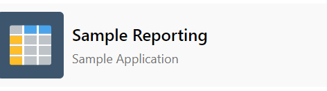
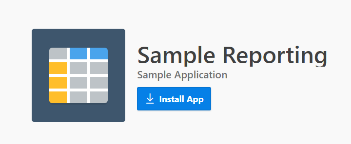
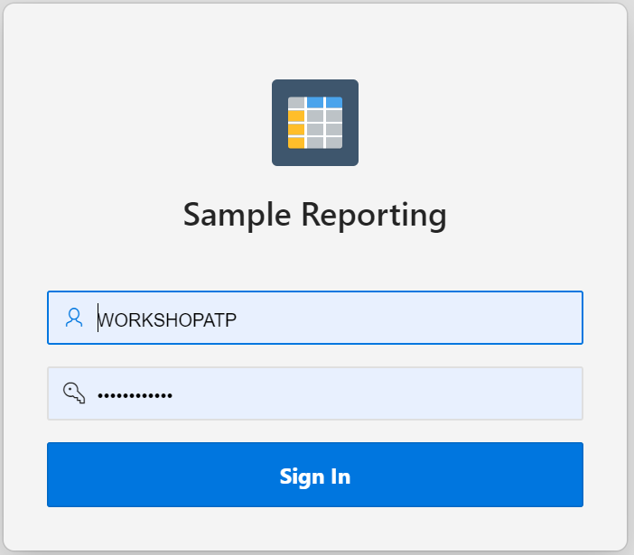

# Step 3: Getting Started with Oracle Application Express

1. Login to cloud.oracle.com 

2. Click on the Autonomous Transaction Processing

3. Select the WORKSHOP instance that you provisioned in [Lab 101](https://github.com/shaukatdesai/nexttraining/blob/master/Step1.md)

   

4. Click on [->Service Console

5. Click on Development and Oracle APEX

   

6. To Log in to Oracle Application Express, , you need a Workspace name, username, and the password created for that Workspace.   We will use the **WORKSHOPATP** workspace, username and password you previously created.

   

7. The Workspace home page appears. Click **App Builder**.

   

8. Toggle between the **View Icons** and the **View Report** buttons. You see that applications are displayed along with their icons and in report format.

   

9. Click **SQL Workshop**. The SQL Workshop home page appears. Review each of the SQL Workshop components.

   

10. Then, click **Team Development**. Review the Team Development components.

   

11. Click **App Gallery**. (note the screenshots are not always up to date)

    

12. The App Gallery page displays all of the Productivity and Sample applications. Click **Sample**.

    

13. Next we will install the Sample Reporting app.  Click **Sample Reporting**.

    

    Click **Install App**.

    

14. Click **Next** and Install App.

    

15. Click the **Run** button.

16. Log in to the Sample Reporting application. Enter your Username and Password (same as your Workspace credentials - **WORKSHOPATP**) and click **Sign In**.

You now see the Sample Reporting application home page. In the Runtime Developer Toolbar, click **Home** and it will take you back to the workspace.

[Back to Labs](https://github.com/shaukatdesai/nexttraining/blob/master/README.md)