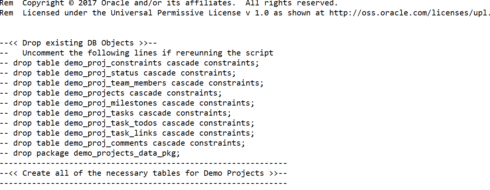

# Step 4: Using SQL Workshop


1. Login to cloud.oracle.com 

2. Click on the Autonomous Transaction Processing

3. Select the WORKSHOP instance that you provisioned in [Lab 101](https://github.com/shaukatdesai/nexttraining/blob/master/Step1.md)

   

4. Click on [->Service Console

5. Click on Development and Oracle APEX

   

6. To Log in to Oracle Application Express, , you need a Workspace name, username, and the password created for that Workspace.   We will use the **WORKSHOPATP** workspace, username and password you previously created.

   [](https://github.com/shaukatdesai/nexttraining/blob/master/APEX%20Login.jpg)

   ### Loading the Tables and Data

   It is essential to have at least the tables defined in order for the Create Application wizard to generate pages in your application. In this hands-on-lab, you will create the required database objects, and populate the tables with sample data.

   

   **Prerequisite - Download the following sql files and save them locally**. [Project_Tables.sql](Project_Tables.sql) &  [Project_Data.sql](Project_Data.sql)

   Once downloaded, open it with Notepad and make sure you can see something like this

   

   

   1. Use SQL Workshop to upload a script that creates the tables for the Demo Projects application. Perform the following steps:

      a) Click **SQL Workshop** and select **SQL Scripts**.

      [](https://github.com/oracle/learning-library/blob/master/workshops/apex-en/images/hol02/image3.png)

      b) Click **Upload**.

      c) Click **Choose File**, navigate to the working directory where you downloaded the Project_Tables.sql file.  Locate the file, and double-click the file or click the file and then click **Open**.

      d) Click **Upload**.

      [](https://github.com/oracle/learning-library/blob/master/workshops/apex-en/images/hol02/image4.png)

      e) Review the uploaded script to see what tables will be created. In the SQL Scripts list, click the **Edit** icon (pencil), to the left of the script you just uploaded.

      [](https://github.com/oracle/learning-library/blob/master/workshops/apex-en/images/hol02/image5.png)

      f) Click the **Run** icon to the right of the script you uploaded. [](https://github.com/oracle/learning-library/blob/master/workshops/apex-en/images/hol02/image6.png)

      Click **Run Now**.

      g) Click the **View Results** icon for the script you just ran.

      [](https://github.com/oracle/learning-library/blob/master/workshops/apex-en/images/hol02/image7.png)

      [](https://github.com/oracle/learning-library/blob/master/workshops/apex-en/images/hol02/image8.png)

   2. Currently the tables you created do not have any data. The Project_Data script has been provided that creates an Oracle database package which can be run at any time to insert or reset the data in the tables. Use SQL Workshop to upload a script that you can use to populate table data. Perform the following steps:

      a) Click **SQL Scripts**. Click **Upload**.

      b) Click **Choose File**, where you dowlonaded the Project_Data.sql script.

      c) Locate the **Project_Data.sql** file, and double-click the file or click the file and then click **Open**.

      d) Click **Upload**. [](https://github.com/oracle/learning-library/blob/master/workshops/apex-en/images/hol02/image9.png)

      e) Click the **Run** icon to the right of the script you uploaded (top row). [](https://github.com/oracle/learning-library/blob/master/workshops/apex-en/images/hol02/image10.png) Click **Run Now**.

      f) Click the View Results icon for the script you just ran (top row). [](https://github.com/oracle/learning-library/blob/master/workshops/apex-en/images/hol02/image11.png)

   3. In the previous step, you uploaded a package called DEMO_PROJECTS_DATA_PKG. However, this package has not yet been run so the tables you created still do not have any data. The SQL Commands facility, within SQL Workshop, allows a developer to run any valid SQL commands. You will run a SQL command to execute the data package and populate the tables. Use SQL Commands to execute n Oracle Database package. Perform the following steps:

      a) Click the Up arrow, before SQL Scripts. [](https://github.com/oracle/learning-library/blob/master/workshops/apex-en/images/hol02/image13.png)

      b) Click **SQL Commands**. [](https://github.com/oracle/learning-library/blob/master/workshops/apex-en/images/hol02/image14.png)

      c) Enter the following code:

      ```
      begin 
      	demo_projects_data_pkg.load_sample_data;
      end;
      ```

      d) Click **Run**. [](https://github.com/oracle/learning-library/blob/master/workshops/apex-en/images/hol02/image15.png) The Results show: Statement Processed.

   4. Use the Object Browser within SQL Workshop to review all of the database objects, such as the tables and packages you created, available in the underlying Oracle database schema which is associated with the Application Express workspace you logged into. Perform the following steps:

      a) At the top of the page, select **SQL Workshop** and then select **Object Browser**. [](https://github.com/oracle/learning-library/blob/master/workshops/apex-en/images/hol02/image16.png)

      b) In Object Browser, select the **DEMO_PROJ_TEAM_MEMBERS** table, and then click on the **Data** tab. [](https://github.com/oracle/learning-library/blob/master/workshops/apex-en/images/hol02/image17.png)

      **Note**: There are a number of other tables listed, outside of those you created using the script file above. The APEX$ tables are created by Application Express to store internal data specific to your workspace. Tables such as DEMO_CUSTOMERS were created when the Sample Database Application was installed. The Sample Database Application is installed by default when an Application Express Workspace is created.

      c) To review the package you created, select Packages and select DEMO_PROJECTS_DATA_PKG. Click **Body** to review the primary PL/SQL rather than the specification. [](https://github.com/oracle/learning-library/blob/master/workshops/apex-en/images/hol02/image18.png)
      **Note**: This package includes complex PL/SQL code to insert images and replicate users entering in records. It is not important that you understand the PL/SQL code in this package, as you will not normally have to populate data in this matter. Generally, you would create the tables with no data and then use the application you build to insert the records. [](https://github.com/oracle/learning-library/blob/master/workshops/apex-en/images/hol02/image19.png)

   

   [Back to Labs](https://github.com/shaukatdesai/nexttraining/blob/master/README.md)
